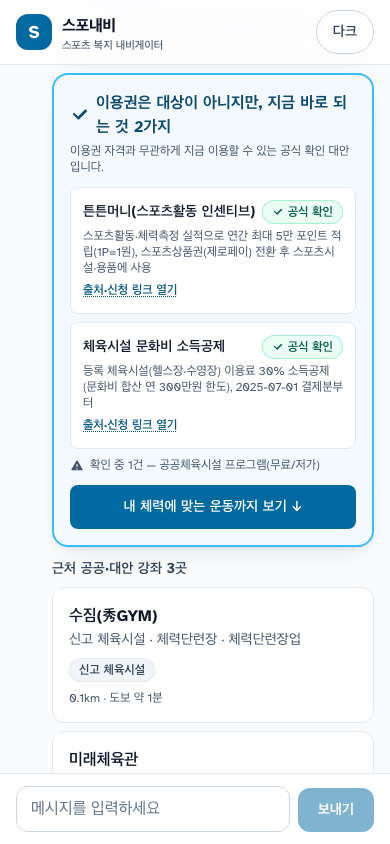
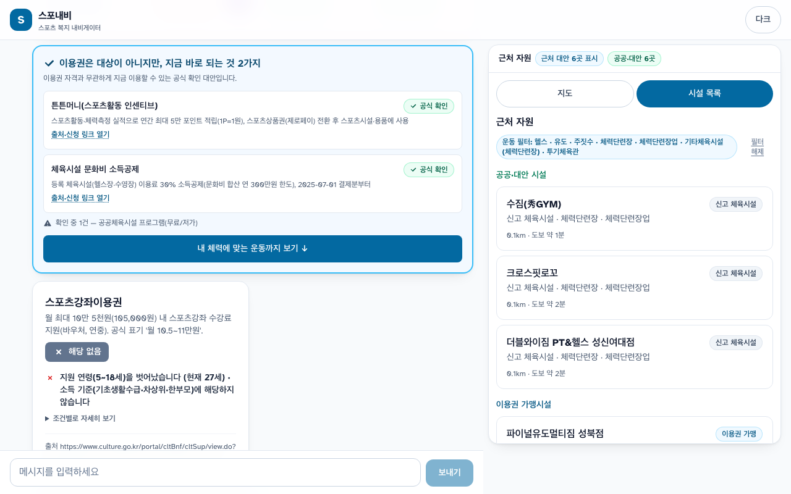
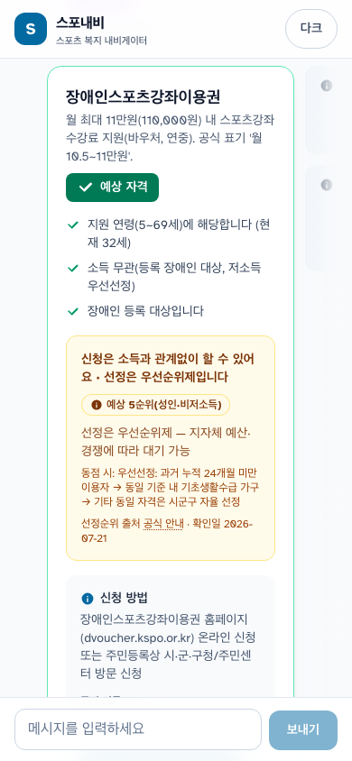
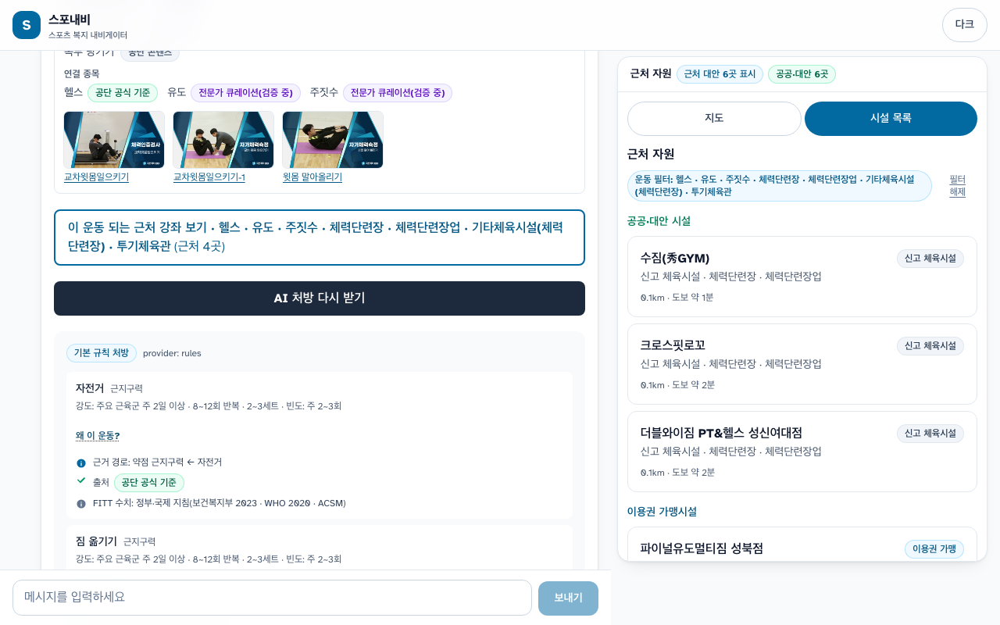
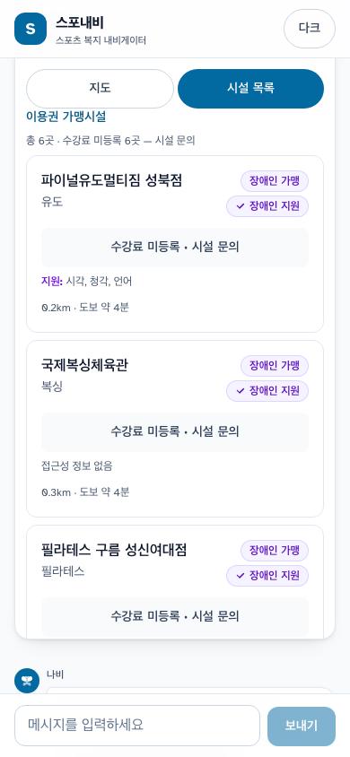
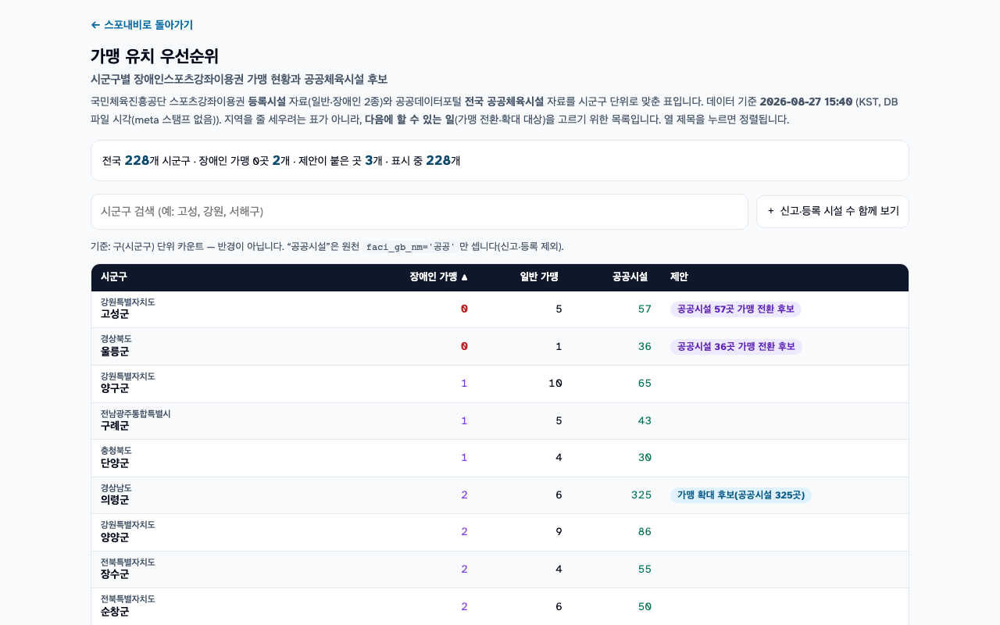

# 활용사례 보고서 초안 — 스포내비 (v0.3, 2026-08-27)

> 제출 양식(붙임1) 필수항목 1~3 + 선택 4~5 구조 그대로. 10장 제한.
> `[■]` = 제출 전 사용자·후속 작업으로 확정 / `[스샷→프로덕션 재촬영 X]` = 로컬 실데이터 촬영본(2026-08-28, `web/e2e-shots/report/`)이 들어가 있음 · 도메인 배포 후 같은 이름으로 프로덕션 재촬영해 교체 / `[확인 필요]` = 출처 미확보.
> **`[■]` 마커는 PDF 내보내기 전에 전부 해소한다** — 제출본에 남은 마커 하나는 그 자체로 "미완성" 신호로 읽힌다.
> 수치는 전부 (a) DB 실측 (b) 공식 발표 원문 확인분만 사용한다. 추정치를 사실처럼 쓰지 않는다.

---

## 1) 활용 데이터명 및 URL (필수항목)

**국민체육진흥공단 (주 데이터, 공공데이터포털 data.go.kr)**

| 데이터 | ID | 서비스 내 역할 |
|---|---|---|
| 스포츠강좌이용권 등록시설 정보 | 15107783 | 이용권 가맹시설 28,772건 적재 |
| 스포츠강좌이용권 등록강좌 정보 | 15107784 | 강좌 66,685건(요일·시각·수강료) |
| 장애인스포츠강좌이용권 등록시설 | 15107874 | 장애인 가맹 8,919건 |
| 장애인스포츠강좌이용권 등록강좌 | 15117341 | 장애인 강좌 23,229건(장애유형별) |
| 전국 공공체육시설 정보 | 15113986·15107764 | 117,863건·실좌표 — **시설구분(공공 43,691 / 신고 73,544 / 등록 628)까지 원천 그대로 라벨** |
| 국민체력100 운동처방 동영상 (7개 오퍼레이션) | 15108846 | 운동 영상 30,090건 — 체력요인×연령군×수준 분류로 처방 근거화, **썸네일·mp4를 https 실링크로 화면에 노출** |
| 국민체력100 체력인증센터 측정결과 | 15108938 | 측정 항목 체계·처방 코퍼스 분석(291만 건 구조) |

합계 **시설 155,554건 · 강좌 89,914건 · 영상 30,090건**, 전국 **시군구 233곳**(2026-07-01 행정구역 개편분 구코드 45건을 별칭으로 흡수) 전역.

**공단 공식 웹 공개 정보 (보조 — 크롤링, robots 허용 범위)**
- 국민체력100 체력인증기준(nfa.kspo.or.kr): 공식 등급 컷오프 **1,052행** — 판정 엔진의 기준값
- 장애인이용권 시설검색(dvoucher.kspo.or.kr): 시설별 장애지원 유형·편의시설 10종 — 공식 API에 없는 접근성 데이터 **10,011건**을 수집·정합해 **6,570개 시설(장애인 가맹의 73.7%)** 에 부착

**타 기관 융합 (허용 규정 명시분)**
- 문화체육관광부 「장애인 생활체육조사」(KOSIS): 문제 정의의 정량 근거
- 문화빅데이터플랫폼 이용권 지역별 통계: 시군구 커버리지

## 2) 서비스 개요 (필수항목)

**27세, 소득 '그 외', 성북구.** 스포츠강좌이용권은 연령(5~18세)도 소득도 대상 밖이다. **그 다음 문장이 스포내비다.**

1. **이용권 ✗** — "연령 5~18 밖 · 소득 기준 밖". 왜 안 되는지를 조건 단위로, 공식 출처 URL·확인일과 함께 알려준다.
2. **"지금 바로 되는 것 2가지"** — 튼튼머니, 문화비 소득공제(둘 다 공식 확인). 공공시설 프로그램 1건은 헤딩 밖에 "확인 중"으로 따로 적는다. 화면에서 가장 큰 블록이 ✗ 카드가 아니라 이쪽이다.
3. **내 체력을 공식 기준으로** — 국민체력100 인증기준으로 항목별 판정: "교차윗몸 35회 — 25~29세 남 3등급 컷 38회 미달"(근지구력 약점 1건).
4. **왜 이 운동인가** — 약점 요인에서 종목·공단 운동처방 영상까지, 지식그래프가 출처를 달고 이어 준다.
5. **그래서 어디서 하나** — 성북구 근처 강좌를 실좌표 우선으로, 시설 출처(공공/신고/등록) 배지와 함께.

> ▶ **QR — P2 데모 바로 열기**: `https://sponavi.kro.kr/demo?p=P2&auto=1`
> `(QR을 열면 P2 여정이 입력→판정→지금 바로 되는 것→체력 판정→근처 강좌까지 자동으로 재생된다 — 화면을 터치하면 멈추고 직접 조작할 수 있다)`

| 항목 | 내용 |
|---|---|
| 서비스 구축(승인) 완료일 | **2026-07-21** (접수기간 2026.6.8~10.2 이내) |
| 운영주체 | `[■ 팀명/대표자]` |
| 서비스 URL | `[■ https://sponavi.kro.kr]` |

**전체 개요** — 스포내비는 스포츠 복지의 사각지대를 줄이는 내비게이터다. 나이·지역·소득계층·장애 여부를 대화로 입력하면 ①받을 수 있는 제도의 **예상 자격과 선정 순위**를 조건별 사유·공식 출처와 함께 판정하고 ②자격이 안 되면 **지금 바로 되는 것**(소득 무관 제도·세제 혜택)을 화면의 히어로로 올리며 ③국민체력100 **공식 인증기준으로 체력을 판정**해 근거 있는 운동 처방과 **실제 수강 가능한 근처 강좌**까지 잇는다. 모든 안내에 출처와 확인일이 붙고, 모르는 것은 모른다고 표시한다.

### ㅇ 서비스의 우수성 및 필요성

**정보가 안 닿고(71.5%), 닿아도 갈 곳이 없다(44.3%).** 두 기둥 모두 공식 통계다.

- **장벽 ① 정보가 안 닿는다** — 장애인의 **71.5%가 생활체육 정보를 접해본 적이 없다**(문체부 장애인 생활체육조사 2025, 7년 연속 70%대). 제도를 몰라서 못 받는 사람이, 자격이 안 돼서 못 받는 사람보다 많다.
- **장벽 ② 닿아도 갈 곳이 없다** — 강좌를 듣지 않는 이유의 최대 축이 **공급 부족 44.3%**(동 조사)다. 장애인이용권은 **가맹시설의 49.2%가 한 번도 이용되지 않았고**(2022 국정감사), 그 공백이 지도 위 어디인지는 본 서비스 DB로 바로 짚힌다 — 성북구는 일반 가맹 161곳·장애인 가맹 41곳인 반면 **강원 고성군과 경북 울릉군은 장애인 가맹이 0곳**(전국에서 이 두 곳뿐, 2026-08-22 전국 행정코드 정규화 기준)이다. 이는 사업의 결함을 지적하려는 수치가 아니라 **"다음 가맹을 어디에 늘려야 하는가"의 좌표**다. 반대로 인천 옛 서구의 "383:0"처럼 2026-07-01 구 재편 코드 전환기 때문에 생긴 **거짓 공백**은 영역그룹 합산(실영역 445:114)으로 차단해, 없는 문제를 만들지 않는다.

**기존 서비스가 안 하는 것을 한다.**
- 자격이 **안 되는** 사람에게 다음 경로를 주는 서비스가 없다 — 복지로는 매칭만, 공단 공식 사이트는 확정 수급자용이다. 스포내비는 탈락 사유별로 공식 확인된 대체 경로(튼튼머니·문화비 소득공제 등)를 결과 화면의 **가장 큰 블록**으로 올린다.
- **"신청은 소득 무관, 선정은 우선순위"** — 장애인이용권의 실제 구조(공식 선정순위 5단계)를 개인화해 예상 순위까지 알려주는 안내는 공단 공식 FAQ(27건)에도 없다.
- **정직성의 제품화**: 좌표가 구 중심 근사면 "위치 근사" 배지를 달고 거리를 쓰지 않는다. 수강료가 비어 있으면 "무료"가 아니라 "미등록 · 시설 문의"다. 신고·등록 시설을 "공공체육시설"이라 부르지 않는다. 데이터의 한계를 숨기지 않는 것이 공공데이터 서비스의 신뢰라고 믿는다.

### ㅇ 국내외 시장 및 경쟁 현황

| 서비스 | 하는 것 | 스포내비와의 차이 |
|---|---|---|
| 복지로 맞춤형 급여안내 | 상황 입력→복지 89종 매칭 | 자격 미달 시 대안 없음, 스포츠 특화 아님 |
| 공단 svoucher/dvoucher | 확정 수급자의 신청·시설 검색 | 자격 판정·대안·접근성 필터 없음 |
| 국민체력100 | 센터 측정·인증·처방 | 측정 후 "어디서 운동하나"와 단절 |
| 토스 숨은 지원금 (민간) | 정부 혜택 매칭 | 종료 정황, 스포츠·체력 없음 |

스포츠 + 복지자격 + 대체경로 + 체력처방을 한 흐름으로 묶은 서비스는 국내외 조사에서 확인되지 않았다(선행 서비스·논문 조사 기준).

**시장 규모** — 네 층으로 존재하며, 아래 수치는 전부 공식 발표 원문에서 확인한 값이다.

① **유료 수요처(B2G)**: 전국 **시군구 233곳** + 공단. 각 시군구는 자기 지역의 가맹 공백을 판단할 근거 표를 상시로 갖고 있지 않다 — 뒷면 `gap.html`이 그 표다.

② **제도 수혜자(연 단위 확정 수요)**: 2026년 (장애인)스포츠강좌이용권 지원 대상은 저소득 유·청소년 **12만 명**과 장애인 **2만 5,900명**, 합계 **15만여 명**이다(국민체육진흥공단 발표, 2025-11-10 보도 인용 — `[확인 필요: 공단 보도자료 원문 URL]`). 지원 단가는 유·청소년 월 10만 5천 원(연 최대 126만 원), 장애인 월 11만 원(연 최대 132만 원)이다(공단 K스포에듀 공고 2025-11-07, edu.kspo.or.kr).

③ **잠재 대상 모수**: 등록장애인은 **262만 7,761명(전체 인구의 5.1%)** 이다(보건복지부 「2025년 등록장애인 현황」 2026-04-20 발표, 2025년 말 기준). 이 중 65세 이상이 149만 6,135명(56.9%)이므로 장애인이용권 대상 연령(5~69세, **소득 무관**)은 나머지 113만여 명에 65~69세를 더한 구간이다 — 즉 ②의 2만 5,900명은 모수의 **2%대**이고 나머지 대부분이 "신청하지 않았거나 선정되지 않은" 층이다. 스포내비의 1차 사용자가 여기에 있다.

④ **제도 밖 회색지대**: P2처럼 연령·소득 모두 제도 밖인 성인은 제도 통계 자체가 존재하지 않는다. 본 서비스는 ①·②(유료 수요처·제도 수혜자)의 확정 수요만으로 성립하도록 설계했고, 제도 밖 성인(대표 데모 P2)은 모수 미상의 상방 여지로만 둔다.

확산 경로는 개인(B2C 무료)과 지자체·복지기관(B2B2C/B2G)의 이중 구조다.

### ㅇ 서비스 내용 상세 (주요 기능)

 `[스샷→프로덕션 재촬영 P2-journey-390]` — 폰 390px 한 화면에 담긴 P2 여정(✗ → 지금 바로 되는 것 → 체력 → 강좌)

1. **자격 판정 + "지금 바로 되는 것" 히어로** — 제도별 예상 자격을 조건 단위 사유("연령 5~18 밖 · 소득 기준 밖")와 공식 출처·확인일로 판정한다. ✗ 카드는 지우지 않되 작게 두고, **결과 덱 밖 전폭 블록**으로 "이용권은 대상이 아니지만, 지금 바로 되는 것 **N가지**"를 올린다. **N은 공식 확인된 대체 경로 수만** 센다(P2 = 튼튼머니·문화비 소득공제 2건). 검증이 끝나지 않은 항목(공공시설 프로그램)은 N에 넣지 않고 블록 안에 **"확인 중 1건"** 으로 따로 적는다 — 헤딩의 숫자가 곧 약속이기 때문이다.  `[스샷→프로덕션 재촬영 P2-hero-1280]`
2. **선정순위 안내(장애인이용권)** — "**소득과 관계없이 신청할 수 있습니다**" 강조 + 공식 5단계 선정순위 기반 **예상 순위**("예상 5순위(성인·비저소득) — 지자체 예산에 따라 대기 가능")를 결정론으로 계산해 보여주고, 대기 중에 할 수 있는 것을 같은 화면에서 잇는다.  `[스샷→프로덕션 재촬영 P5-priority]`
3. **체력 판정(국민체력100 완전 연동)** — 공식 인증기준 **1,052개 컷오프**로 항목별 판정("교차윗몸 35회 — 25~29세 남 3등급 컷 38회 미달")과 참고 등급(추정)을 낸다. 약점 요인은 지식그래프(노드 1,882·엣지 7,419 — 공단 공식 기준·정부 지침·공단 영상 분류·전문가 큐레이션 4단 출처)로 운동·**공단 운동처방 영상**·근처 강좌에 연결되며, 영상은 공단 원천의 **썸네일 이미지와 mp4 링크를 https 실링크로** 띄운다. AI 문장은 검증된 슬롯만 채우고 실패 시 규칙 기반으로 폴백하며, 어느 쪽이 썼는지 제공자 라벨로 밝힌다. 데모 페르소나(P2·P5)는 측정값이 미리 채워져 있어 심사위원이 값을 지어내지 않아도 끝까지 흐른다(문진 프리셋에는 "데모 프리셋 — 실사용은 직접 확인" 라벨).  `[스샷→프로덕션 재촬영 F1-fitness-thumbs]`
4. **근처 시설·강좌 검색(좌표 정직성)** — 전국 155,554 시설·89,914 강좌. **실좌표 보유 시설을 구 중심 근사 시설보다 먼저** 정렬하고, 근사 시설에는 "위치 근사" 배지를 달고 거리를 쓰지 않는다. 요약 문구는 **"근처 N곳 표시 · 성북구 가맹 161곳"** 처럼 화면에 실제 표시한 수와 구 단위 카운트를 분리한다. 시설 출처는 원천 구분 그대로 **공공 / 신고 / 등록** 배지로 표기한다(개방 데이터 117,863행 중 신고가 62.4%이므로 이를 통칭 "공공체육시설"이라 부르면 원천을 바꿔 부르는 것이 된다). 수강료가 비어 있으면 수강료·지원금·자부담 **세 칸 모두** "미등록 · 시설 문의"로 적고, 결측이 대부분인 섹션은 상단에 "총 N곳 · 수강료 미등록 M곳 — 시설 문의" 한 줄을 둔다. 자격 ✗ 사용자에게는 **지원금을 차감하지 않는다**(자부담 = 수강료).
5. **접근성 정보·필터(장애인이 1차 사용자)** — 시설별 장애지원 유형(8종)·편의시설(휠체어 대여 577곳·수중리프트 177곳 등 10종) 필터와 태그. 공식 API에 없는 정보를 공단 웹 공개 정보에서 수집·정합 검증(대사 97.5%)해 제공하고, 정보가 없는 시설은 "접근성 정보 없음"으로 미상과 부재를 구분한다.  `[스샷→프로덕션 재촬영 P3-accessibility]`
6. **뒷면 — "가맹 유치 우선순위" 표(`gap.html`)** — 같은 데이터의 정책담당자용 얼굴. 시군구별로 **장애인 가맹 · 일반 가맹 · 공공시설(원천 구분 '공공'만) · 제안**을 한 표에 정렬해 보여주는 정적 페이지다(`/gap`). 시민용 앞면과 정책용 뒷면이 한 데이터에서 나오는 양면 제품이며, 이것이 아래 사업화 서사의 실물이다.  `[스샷→프로덕션 재촬영 gap-page]` `228개 시군구(영역그룹 합산 기준) · 제안이 붙은 곳 3개(전환 후보 2·확대 후보 1)`

### ㅇ 기대효과 (파급효과)

**정량**
- 정보 도달: 제도 인지 채널이 없던 인구(정보 미접촉 71.5%)에게 자격·대안·시설·처방을 한 화면에 — **이용권 발급 대비 실사용률 62.8%**(2019~22 누적)와 예산 집행률 개선에 직접 기여할 수 있는 지점이다.
- 공급 진단: 시군구×제도×종목 공백을 실데이터로 상시 산출 — 가맹 유치·예산 배분의 근거.
- 접근성 정보: 흩어져 있던 시설별 편의시설 정보 6,570곳 분을 검색 가능한 형태로 통합.

**정성** — "왜 안 되는지"와 "그래서 뭘 할 수 있는지"를 함께 주는 복지 안내의 표준을 제시. 데이터 한계의 정직한 표시로 공공데이터 서비스의 신뢰 모델을 제안한다.

### ㅇ 지속가능성 및 사업화 방안

개인 서비스는 무료로 유지한다. 매출은 **축적되는 공급공백·커버리지 데이터**에서 나온다.

① **이미 인도 가능한 자산 2종(추가 개발 0)** — ②의 표를 공단 스포츠복지팀 관점으로 재정렬하면 그대로 **가맹 유치 대상 리스트**가 되고, 서비스 구축 중 확인된 데이터 품질 이슈(아래 4항 4건)는 **개방 데이터 개선 피드백**이 된다. 두 가지 모두 이미 만들어져 있어 추가 개발이 필요하지 않다.

② **"가맹 유치 우선순위" 표의 구독·제공(B2G)** — **한 곳을 더 파는 한계비용이 사실상 0이다.** 월 1회 자동 갱신 파이프라인이 이미 동작하므로, 대상이 늘어도 새로 만들 것이 없다. 시군구·시도 대상 연간 구독이며, 아래 금액은 실제 계약이 아니라 **가정**이고 그렇게 표기한다 — 가격을 **연 300만 원(가정)** 으로 두면 **20곳 계약 시 연 6,000만 원(가정)** 이다. 전국 시군구 233곳이 모수이므로 20곳은 8.6% 침투에 해당한다. `[■ 실제 조달 단가·계약 형태 조사]`

③ **중개기관 채널(B2B2C)** — "71.5%는 웹 밖 인구"라는 반론에 대한 답은 사람이 있는 창구다. 후보 3곳은 임의로 고른 것이 아니라 **우리 데이터가 지목한 채널**이다: 성북구만 봐도 일반 가맹은 161곳인데 장애인 가맹은 41곳이다. 선택지가 이렇게 얇은 층일수록 개인 검색만으로는 닿지 않고, 그 층을 대면으로 만나는 곳이 **성북장애인복지관 · 특수학교 · 주민센터**다. 이 3곳에 상담 도구(자격 판정 + 대안 + 근처 시설 인쇄용 요약)로 제공하는 안을 담아 메일 1통을 보낸다. 답장 여부와 내용은 사실대로 적는다. `[■ 발송 결과 — "보냈다·답 없었다"도 그대로 기재]`

## 3) 국민체육진흥공단 데이터가 활용된 부분 (필수항목)

| 공단 데이터 | 서비스 내 활용 |
|---|---|
| 이용권/장애인이용권 시설·강좌 4종 API | 자격 판정 후 실제 신청 가능한 가맹시설·강좌 검색의 원천(전량 적재·월 갱신) |
| 전국 공공체육시설 API | 대체 경로의 시설 풀 + 실좌표 기반 반경 검색 |
| 〃 — **시설구분(`faci_gb`)** | 원천 구분(공공 43,691 / 신고 73,544 / 등록 628)을 그대로 **공공·신고·등록 배지**로 표기 — 통칭 금지 |
| 운동처방 동영상 API 7종 | 체력요인×연령군 분류를 지식그래프 엣지로 변환 — 처방의 공단 콘텐츠 근거 |
| 〃 — **썸네일·동영상 파일** | 원천 이미지·mp4를 https 실링크로 조립해 처방 화면에 직접 노출(공단 콘텐츠의 최종 소비 지점) |
| 국민체력100 인증기준(웹) | 체력 판정의 공식 컷오프 1,052행(수기 대조 23항목 일치 검증) |
| 국민체력100 측정결과 API | 측정 항목 체계 분석·처방 코퍼스 구조 확인 |
| 장애인이용권 웹 공개 정보 | 접근성(장애유형·편의시설) 10,011건 — API 부재분 보완 |
| 공단 선정순위·FAQ 체계 | "신청 무관 / 선정 순위" 이중 구조 안내의 원문 근거 |
| **시군구별 가맹 집계(전 데이터 교차)** | 뒷면 `gap.html` "가맹 유치 우선순위" 표 — 공단·지자체용 정책 자산 |

## 4) 추가로 개방이 필요한 데이터 (선택항목)

서비스 구축 과정에서 실측으로 확인한 개방 요청 4건:

1. **장애인이용권 시설의 사업자번호·시설일련번호** — 현행 API에 조인 키가 없어 강좌↔시설 연결과 타 데이터 결합이 불가능하다(전 8,919건 실측). 일반 이용권 API에는 있는 필드다.
2. **이용권 가맹시설 좌표** — 시설 API에 위경도가 없어 거리 기반 안내가 불가하다. 공단 공식 웹도 주소를 실시간 지오코딩으로 처리하는 것을 확인했다 — 원천 개방이 이용자·개발자 모두의 비용을 줄인다.
3. **시설별 편의시설·장애지원 정보의 API화** — 현재 웹 화면에만 존재하는 접근성 정보(본 서비스가 수집·정합한 10,011건)는 장애인 이용자에게 자격 정보만큼 중요하다.
4. **등록강좌 수강료 결측** — 장애인이용권 등록강좌의 수강료 필드가 비어 있는 비율이 높다. 실측 예: 성북구 장애인 가맹 6곳은 등록강좌 수강료가 **전부 결측**이었다(2026-08-27 DB 실측). 수강료가 없으면 지원금을 차감한 자부담을 계산할 수 없어 "얼마를 내야 하는지"를 안내할 수 없고, 본 서비스는 그 자리에 "수강료 미등록 · 시설 문의"로 표기한다. 수강료 필수 입력화(또는 결측 사유 코드 제공)를 요청한다.
   (+참고: 이용권 제도 인지도·미신청 사유 조사 데이터가 부재해 정책 효과 측정이 어렵다.)

## 5) 데이터 정직성 설계 원칙 (자유 항목)

공공데이터의 한계를 숨기는 대신 **표시 규칙으로 표준화**했다. 아래 7개는 화면 카피가 아니라 회귀 테스트로 고정된 규약이다.

| 상황 | 표기 규칙 |
|---|---|
| 좌표가 구 중심 근사 | "위치 근사(구 중심)" 배지 + **거리 미표기** |
| 이용권 시설 개수 | "근처 N곳 표시 · {구} 가맹 M곳" — 화면 표시 수와 구 단위 카운트 분리 |
| 수강료 필드가 비어 있음 | 수강료·지원금·자부담 3칸 전부 "미등록 · 시설 문의"(0원·"무료"로 채우지 않음) |
| 시설 출처 | 원천 구분 그대로 공공 / 신고 / 등록 — 통칭 "공공체육시설" 금지 |
| 검증이 끝나지 않은 큐레이션 | "확인 중"으로 분리 — 헤딩의 "N가지"에 넣지 않음 |
| 처방 문장의 작성자 | AI / 규칙 제공자 라벨 명시(자격·가격·시설 판단은 AI가 하지 않음) |
| 통계가 없는 지역 | "데이터 없음" — null을 0이나 추정으로 채우지 않음 |

**구현·운영** — FastAPI + SQLite(WAL) · 자격 판정 p95 78ms(개발 환경 실측, bbox 프리필터 도입 시) · React/Vite 챗 UI · 레이트리밋·CSP·non-root 컨테이너·워치독 · 제출 시점 **데이터 동결(`FREEZE.sha`)** 로 보고서 수치와 서비스 화면의 수치를 일치시킨다. 위 규약은 **서버 테스트 · 계약 패리티 · 웹 유닛 테스트(vitest) · E2E spec**이 회귀 검증한다(예: "반경 문구는 실좌표에만"). 계층별 건수는 `[■ 최종 수치]`.

`[■ 팀 소개 1~2줄]`

---
*분량 가이드: 본문 약 7,200자 + 표 6개(41행) ≈ 6~6.5장, 스샷 6장을 각 1/2장으로 앉히면 **약 9~9.5장**. 스샷을 크게 쓰면 10장을 넘길 수 있다. 「시장 규모」 회색지대 층(v0.3에서 ④)은 이미 한 문장으로 축약했으므로, 감축 1순위는 **5) 정직성 표를 7행→5행**, 2순위는 2) 우수성의 '기존 서비스가 안 하는 것' 3번째 불릿이다. 잔여 확정 항목은 팀명·팀 소개·스샷·`[■]` 마커뿐이다.*
